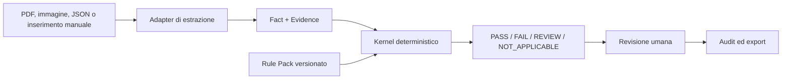

# VERA

**Versioned Evidence-based Rules Assessment**

VERA è un motore generico per valutazioni di conformità documentali, deterministiche, versionate e
verificabili. Separa l’estrazione assistita da AI dalla decisione prodotta dal kernel di regole e
conserva fonti, fatti, evidenze, versioni e revisioni necessarie a ricostruire ogni risultato.

> **Stato del progetto:** sviluppo iniziale. La [roadmap](docs/roadmap.md) è la fonte operativa per
> avanzamento, gate e criteri di completamento.

> **Limite di validazione:** VERA fornisce una verifica esclusivamente tecnica. Esempi, Rule Pack,
> identità, approvazioni, benchmark e report distribuiti con il repository sono sintetici e hanno
> ambito `TECHNICAL_DEMO`. Non costituiscono validazione professionale, certificazione o consulenza.

## Obiettivi

- Rendere le regole serializzabili, testabili e indipendenti da database, interfaccia e provider AI.
- Distinguere sempre applicabilità, rispetto del requisito e qualità delle evidenze.
- Produrre risultati ripetibili con una trace deterministica e un audit trail immutabile.
- Inviare a revisione i casi mancanti, contraddittori o non sufficientemente supportati.
- Conservare un confine netto tra software pubblicabile e materiali locali non tracciati.

## Principi non negoziabili

1. L’AI può estrarre fatti e proporre bozze; non può approvare o attivare regole.
2. Ogni fatto usato da una regola deve essere collegato a un’evidenza verificabile.
3. Ogni finding deve identificare regola, versione, fonte e trace di valutazione.
4. Le versioni pubblicate sono immutabili; attivazioni e rollback sono eventi append-only.
5. Dati sconosciuti, mancanti, illeggibili, contraddittori o privi di evidenza producono `REVIEW`,
   mai un `PASS` implicito.
6. Il kernel non esegue JavaScript arbitrario, `eval`, SQL o chiamate di rete.
7. Nessun risultato dimostrativo viene presentato come validato da un professionista.

## Architettura target



Gli adapter producono soltanto facts ed evidenze. Il resolver seleziona il Rule Pack valido per
ambito e data; il kernel riceve il relativo snapshot JSON e produce findings senza dipendere da AI,
storage o UI.

### Semantica essenziale

- Le espressioni DSL restituiscono `TRUE`, `FALSE` o `UNKNOWN`.
- `appliesWhen = FALSE` produce `NOT_APPLICABLE`.
- `appliesWhen = UNKNOWN` oppure un requisito sconosciuto produce `REVIEW`.
- Per i risultati applicabili, un requisito soddisfatto produce `PASS`; uno non soddisfatto produce
  `FAIL`.
- Nell’aggregazione, `FAIL` prevale su `REVIEW`, che prevale su `PASS`; se tutte le regole sono non
  applicabili, il risultato è `NOT_APPLICABLE`.
- Gli intervalli temporali sono UTC e semiaperti: `validFrom <= evaluationDate < validTo`;
  `validTo = null` indica durata indefinita.

## Stack target

- Monorepo TypeScript strict ed ESM, Node.js `22.22.1` e pnpm `10.33.0`.
- Schemi Zod come fonte unica per tipi TypeScript, validazione, JSON Schema e contratti API.
- API REST `/v1` con Fastify, OpenAPI, Problem Details, idempotenza e optimistic concurrency.
- PostgreSQL con Prisma, `jsonb` e `pgvector`; blob store locale content-addressed.
- React e Vite per l’interfaccia di revisione.
- Adapter locali per OCR, vision, LLM ed embedding tramite Ollama.
- Vitest, fast-check, Testcontainers e Playwright per test unitari, property-based, integrazione ed
  end-to-end.

## Struttura del repository

VERA usa un solo repository. I confini sono applicati tramite struttura, `.gitignore`, controlli
automatici e dati dimostrativi sintetici.

```text
vera/
├── apps/
│   ├── api/
│   └── web/
├── packages/
│   ├── contracts/
│   ├── extractors/
│   ├── rag/
│   ├── rules-core/
│   ├── rules-testing/
│   └── storage/
├── examples/                 # solo scenari sintetici pubblicabili
├── docs/
│   ├── roadmap.md
│   └── verification/         # evidenze dei gate per fase
├── datasets/                 # materiale locale ignorato da Git
└── README.md
```

Il contenuto locale di `datasets/` non è parte del prodotto pubblicabile, non è una fixture di test
e non è un criterio di completamento. Test, benchmark, demo e release usano esclusivamente corpus
sintetici tracciati e chiaramente identificati.

## Modello pubblico

I contratti principali previsti sono:

- `ComplianceSource` e versioni append-only;
- `RuleCard` e workflow di revisione/approvazione;
- `Fact<T>` ed `Evidence` con localizzazione normalizzata;
- `RuleDefinition`, AST DSL e `RuleFinding`;
- `RulePackVersion` e `ActivationEvent` separati;
- `EvaluationRun`, `ReviewDecision` e `CalibrationProfile` immutabili;
- `ExtractorAdapter` comune per input manuali, JSON e provider locali.

Le evidenze usano pagine 1-based e bounding box normalizzate in `[0,1]`, con origine nell’angolo
superiore sinistro. Hash di file e snapshot canonicalizzati sono SHA-256.

## Strategia di test e rilascio

Ogni fase deve superare i gate pertinenti prima di essere chiusa:

- format-check, lint, typecheck e build;
- test unitari, di integrazione, contract e property-based;
- soglie di copertura definite nella roadmap;
- scansioni di sicurezza, licenze, segreti e confine pubblico;
- Playwright dalla fase UI;
- smoke test locali Ollama nelle fasi che esercitano adapter o benchmark.

Al termine di una fase vengono salvate le evidenze in `docs/verification/phase-N.md`, aggiornata la
roadmap, creato un commit dedicato e verificata la CI prima di iniziare la fase seguente.

## Ordine di sviluppo

| Ordine | Fase | Risultato                       | Stato |
| -----: | ---: | ------------------------------- | :---: |
|      1 |    0 | Confini pubblici e fondazione   | `[x]` |
|      2 |    1 | Specifica metodologica          | `[x]` |
|      3 |    2 | Fonti di conformità             | `[x]` |
|      4 |    3 | Rule Card                       | `[x]` |
|      5 |    4 | Facts, evidenze ed estrattori   | `[x]` |
|      6 |    5 | DSL dichiarativa                | `[x]` |
|      7 |    6 | Kernel deterministico           | `[x]` |
|      8 |    7 | Rule Pack e versionamento       | `[x]` |
|      9 |    8 | Test runner e version diff      | `[x]` |
|     10 |    9 | Benchmark sintetico             | `[x]` |
|     11 |   10 | Calibrazione e astensione       | `[x]` |
|     12 |   13 | Provenienza e audit             | `[x]` |
|     13 |   14 | API, persistenza e sicurezza    | `[ ]` |
|     14 |   11 | RAG e ingestione                | `[ ]` |
|     15 |   12 | UI di revisione                 | `[ ]` |
|     16 |   15 | MVP dimostrativo sintetico      | `[ ]` |
|     17 |   16 | Apertura e release sperimentale | `[ ]` |

L’ordine intenzionale porta audit e persistenza prima di RAG e UI, così queste funzionalità nascono
già sopra contratti stabili e tracciabili.

## Materiali pubblicabili

- Sono ammessi soltanto esempi, corpus, fonti, Rule Pack e identità sintetici.
- Gli asset sintetici devono riportare chiaramente `validationScope=TECHNICAL_DEMO`.
- Scanner automatici controllano working tree, indice e cronologia raggiungibile prima di una
  release.
- L’apertura del repository richiede l’ultimo gate della Fase 16 e una conferma esplicita
  dell’operatore.

## Documentazione

- [Roadmap completa](docs/roadmap.md)
- [Metodologia normativa](docs/methodology.md)
- [DSL dichiarativa](docs/dsl.md)
- [Kernel deterministico](docs/kernel.md)
- [Rule Pack e risoluzione temporale](docs/rule-packs.md)
- [Rule testing e version diff](docs/rule-testing.md)
- [Benchmark sintetico](docs/benchmark.md)
- [Calibrazione e astensione](docs/calibration.md)
- [Provenienza e audit](docs/audit.md)
- Le specifiche API e operative saranno aggiunte e versionate nelle rispettive fasi.

## Licenza

La release pubblica è pianificata con licenza Apache-2.0 nella Fase 16. Fino al completamento di
quella fase, la presenza di questo file non implica che il progetto sia già pronto per una
distribuzione pubblica.
